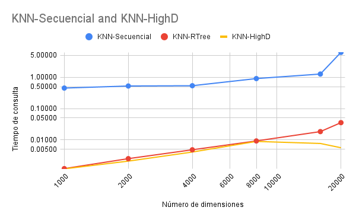

# DataFusion-DB-B-squeda-y-Recuperaci-n-de-la-Informaci-n

- ! Importante:
  Indice invertido parte algortimica (backend): En la rama index_spimi1 con nombre Spimi_Optimizacion.ipynb
- En la rama compiler se encuentra el front y el back listo para fusionar

## Introducción

### Objetivo del proyecto

El objetivo del proyecto es recuperar información, ya sea de tipo textual mediante un índice invertido o multimedia utilizando un índice multidimensional. Asimismo, se busca comparar las técnicas implementadas con otras soluciones existentes. Por ejemplo, se desarrolló SPIMI para compararla con el índice GIN de PostgreSQL. Además, se realizará una comparación de índices multidimensionales aplicando búsquedas KNN de manera secuencial en estructuras como R-Tree y en espacios de alta dimensionalidad.

### Dominio de datos Índice invertido

Para el índice invertido empleamos el dataset dado por Kagle: [spotify_songs](https://www.kaggle.com/datasets/imuhammad/audio-features-and-lyrics-of-spotify-songs). Este dataset contiene información diversa sobre más de 18,000 canciones de Spotify, incluyendo datos sobre el artista, álbum, características acústicas (como la sonoridad), letras, idioma de las letras, géneros y subgéneros.

Para la indexación nos centramos en las siguientes columnas:

- track_name: Nombre de la canción.
- track_artist: Artista de la canción.
- lyrics: Letra de la canción.
- track_album_name: Nombre del álbum al que pertenece la canción.

## Backend: Índice Invertido

### Construcción del índice invertido en memoria secundaria


Clase SPIMI con los atributos más relevantes.

- Inicializa la clase SPIMI con parámetros como la ruta al conjunto de datos, directorios de bloques, columnas a indexar y límite de tamaño de disco.
- Configura rutas y archivos para almacenar los índices, y carga el conteo de documentos desde un archivo si ya existe.


Proceso para construir el índice invertido en memoria secundaria SPIMI

- Realiza la indexación de los documentos, creando bloques de términos invertidos.
- Lee el conjunto de datos en bloques (chunks), procesa el texto y realiza el preprocesamiento (tokenización y limpieza), y construye un diccionario de términos por documento. Si un bloque supera el límite de memoria, lo escribe en disco.


Implementación de merge usando un Min-Heap

- Fusiona los bloques de términos invertidos en un índice único utilizando un Min-Heap.
- Abre los bloques, extrae los términos y sus postings, y fusiona los postings en un único archivo ordenado de acuerdo con el término. Calcula el TF-IDF para cada documento y guarda los resultados.


Proceso para realizar la consulta en memoria secundaria

- Realiza una consulta sobre el índice invertido y devuelve los documentos más relevantes.
- Preprocesa la consulta, calcula el TF-IDF de los términos en la consulta y los documentos, y calcula la similitud entre la consulta y los documentos usando el coseno del producto. Devuelve los documentos con las puntuaciones más altas.

### Ejecución óptima de consultas aplicando Similitud de Coseno

Para probar que nuestro índice invertido funciones bien nos apoyamos de get_dfTex_Cols.


La función recibe tres parámetros: la ruta del archivo CSV (path), el índice de la fila desde la que se extraerán los datos (row), y una lista de índices de las columnas deseadas (columnas). Utiliza pandas para cargar el archivo CSV y extraer los valores de las columnas seleccionadas en la fila indicada. Los valores extraídos se unen en una sola cadena de texto, separados por espacios. Esta función facilita la validación rápida de que la similitud de coseno de 1. Es relevante mencionar que dicha función solo sirve para el testeo.

Para obtener los resultados de manera eficiente en término de memoria secundaria se emplea la siguiente función:


La función lee el archivo CSV en bloques utilizando la función pd.read_csv() con el parámetro chunksize establecido en disk_limit. Esto permite que los datos se carguen de manera incremental, evitando la carga completa del archivo en memoria, lo que es fundamental cuando se trabaja con archivos grandes.
Para cada bloque de datos (chunk), la función recorre la lista result y calcula el índice global del documento en el bloque actual, basado en el número de bloque.
Si el índice del documento está dentro del rango del bloque actual, la función extrae la fila correspondiente y le agrega una columna adicional llamada score que contiene el puntaje asociado al documento.
Cada fila procesada se agrega a una lista res y se retorna las filas del csv.

#### Pruebas

#### Filas similares

Una prueba interesante es con la canción de la fila 2 del csv, puesto que, esta se repite en varias filas solo que varían algunos parámetros como el id de la canción.

En la siguiente figura se visualiza cómo la canción de la fila 2 es la más cercana


Obteniendo los siguientes Scores respectivos:


Si nos damos cuenta nuestro índice si funciona, puesto que para la fila 2 da un score de 1 y para las 3 siguientes da un score de casi 1, puesto que, los lyrics son los mismos. Esto demuestra que nuestro índice es correcto porque da un score adecuado con respecto a la similitud

#### Similitudes de 1

- Query:


- Resultados:


Scores:


#### Consultas por texto

- Query:


- Resultados:


- Score:


- Query:


- Resultados:


- Score:


#### ¿Pero qué sucede si nos trae otro?

Por ejemplo en la siguiente query se espera que la letra "Crashing, hit a wall Right now I need a" este cómo primer resultado, sin embargo aparece "You don't really know what you got yourself"

- Query:


- Resultados:


- Score:


Entonces lo que hacemos es mandarle el nombre del artista:

- Query:


- Resultados:


- Score:


En este caso pudimos observar que si bien es cierto esperábamos que "Crashing, hit a wall Right now I need a" sea obtenido como primer resultado no paso ello, sin embargo estuvo en segundo y además si le colocamos el título logramos incrementar su score

### Cómo se construye el índice invertido en PostgreSQL

- La función create_table() crea una tabla en la base de datos llamada songs con varias columnas, incluyendo info_vector de tipo tsvector. Este vector va a contener la infórmación relevante de la fila.
- Después set_index() crea un índice invertido en la columna info_vector, utilizando el índice GIN de postgres.
- Luego la función insert_all() carga los datos de un archivo CSV (songs.csv) en la tabla songs.
- Subsecuentemente, la función update_index() nos permite seleccionar el lenguaje a escojer.

  

  Se utilizan los pesos asignados por la función setweight() para dar diferentes niveles de relevancia a cada columna. El peso más alto, 'A', se asigna al nombre de la canción (track_name), el siguiente peso, 'B', al nombre del álbum (track_album_name), y los pesos 'C' y 'D' se asignan al nombre del artista (track_artist) y las letras (lyrics), respectivamente.

  Los vectores de cada columna son obtenidos con to_tsvector. Este tipo de dato está optimizado para búsqueda rápida y eficiente, pues guarda una lista con los lexemas, sus posiciones y su peso en el documento.

- Finalmente realizamos las consultas. Dado una oración que buscar, se realiza un preprocesamiento en el que se quitan los símbolos especiales, y se reemplaza los espacios en la palabra el símbolo _|_, pues este representa un _or_. Luego del preprocesamiento, se usa to_tsquery para obtener el vector característico usado para realziar la búsqueda. Para determinar las tuplas más cercanas, se usa ts_rank_cd para obtener un score numérico por el que ordenar.

### GIN
Tanto GIN como GIST trabajan con columnas de tipo tsvector.

Por el lado de GIST, puede producir falsos positivos. Esto se debe a que los documentos son representados por una firma de longitud fija. Como la firma es generada por un hash de la palabra en un n-bit string, cuando dos palabras distintas tienen el mismo bit de hash, se produce un falso positivo. Esta pérdida se resuelve comparando con el registro original; sin embargo, el costo de ingresar a las columnas hace que GIST pierda performance.

Por otro lado, GIN no pierde información y su performance depende logarítmicamente de la cantidad única de palabras.

De manera general, Postgres recomienda GIST para datos que se actualizan constantemente y GIN para datos estáticos. Por otro lado, GIST es muy veloz con 100,000 palabras únicas, mientras que a partir de ese dato, GIN es mejor, pero más lento para las actualizaciones.

El índice GIN fue añadido en la versión 8.2 de PostgreSQL aproximadamente hace 15 años.
GIN internamente consiste en un B-tree construido por (ET, entries tree). Cada entrada es un elemento del valor indexado (elemento, lexema), y cada una de estas tuplas en una hoja del B-tree es un puntero hacia otro B-tree que apunta hacia un posting tree o hacia una lista de postings si la tupla es aún pequeña.

GIN trabaja con ayuda de una lista de entradas pendientes que optimiza su performance, debido a que la actualización es costosa. Pero esta estrategia significa que se debe buscar en la lista de entradas también.

En GIN, la inserción puede ser lenta, por lo que para grandes datos es mejor eliminar el índice, insertar los datos y luego aplicar nuevamente el índice.

## Backend: Indice Multidimensional

### KNN 
Por el dado de KNN, empleamos como parámetro de distancia el coseno, para esto iteramos todos los vectores característicos y en un heap de tamaño K, pusheamos y popeamos el de mayor distancia, para así quedarnos con los más relevantes.


### Extracción de características

- A diferencia de utilizar la version matricial luego aplanada de las imágenes para indexar y probar los índices de recuperación, optamos por el enfoque de utilizar descriptores globales, utilizamos el modelo pre entrenado Resnet 152 que tiene la siguiente arquitecutura:


- Resumiendo el proceso, en las capas de convolución analizar la imágenes por cuadrillas de 7 x 7, luego de 3 x 3 en las sigueintes 4 capas, además de esto se aplican técnicas de MaxPooling y AvgPooling, que reducen el ruido tomando el valor máximo en cada grilla de 3 x 3 y la complejidad mediante la redución del tamaño de la imágen procesada. Al final de todo se aplica un ajuste del vector representativo aplanado con 1000 parámetros para obtener las características relevantes de las imágenes, en nuestro caso la variación de ResNET 152 genera un vector representativo de 2048 características.

- Este es el código para configurar la extracción
```python
from models.resnet.extract_resnet import ExtractResNet
from utils.utils import build_cfg_path
from omegaconf import OmegaConf
import torch
device = 'cuda' if torch.cuda.is_available() else 'cpu'
torch.cuda.get_device_name(0)

feature_type = 'resnet'
model_name = 'resnet152'

args = OmegaConf.load(build_cfg_path(feature_type))
args.feature_type = feature_type
args.model_name = model_name
args.batch_size = 32

extractor = ExtractResNet(args)

```
- Ahora procesamos la extracción por batches, para no sobrecargar la memoria:
```python

features_list = []
current_image = 0
for image_path in args.image_paths:

#--------------------- Guardamos cada 500 embeddings creados --------------------#
  if len(features_list) % 500 == 0:
    current_image += len(features_list)
    with open(save_path + "_"+ str(current_image), 'wb') as f:
      pickle.dump(features_list, f)
    features_list = []

  feature_dict = extractor.extract(image_path)
  features_list.append({
      'image_name':image_path.split('/')[-1],
      'embedding': feature_dict['resnet']
  })
#--------------------- Guardamos cada los últimos embeddings --------------------#
current_image += len(features_list)
with open(save_path + "_"+ str(current_image), 'wb') as f:
  pickle.dump(features_list, f)

```
- Mapeamos 5 imágenes vacías del csv que retiraremos:
```python
shapes_images = pd.DataFrame(list_image_shapes)
reps_shapes_images = shapes_images[shapes_images['shape'] == (0,)]
reps_shapes_images_idx = reps_shapes_images.index
shapes_images_vacio = shapes_images.iloc[reps_shapes_images_idx]
```
  

- Toda esta información son embeddings almacenados por listas en `embeddings.pkl` listos para la indexación.

- Ahora guardamos el modelo para la inferencia en la demo:
```python
torch.save(extractor.model.state_dict(), "/resnet152_features.pth")
```
- Este es el código para volver a cargarlo:
```python
extractor.model.load_state_dict(torch.load("/resnet152_features.pth"))
```

### Descriptores locales

- Los descriptores se definen como factores que contienen detalles en los objetos multimedia pero de pequeñas proporciones del archivo, estos que permiten describir las imágenes y en comparaciones múltiples es mucho más robusto por prevalacer en la similitud de características granulares de las imágenes, la idea detrás de su efectividad es que se obtienen mediante procesos minuciosos de exploración de imágenes, como son las redes neuronales CNN.

- En la práctica se aplican técnicas eficientes con modelos pre entrenados como:
- SIFT (Scale-Invariant Feature Transform):
  Basada en detectar puntos clave en diferentes escalas y orientaciones. Utiliza un histograma de gradientes orientados para describir la región local alrededor de cada punto clave, lo que la hace resistente a cambios de escala, rotación, iluminación y perspectiva.

- SURF (Speeded-Up Robust Features):
  Similar a SIFT, pero más rápida. Usa aproximaciones rápidas de convoluciones basadas en el uso de "cajas de filtro" para detectar puntos clave y describirlos utilizando un histograma de gradientes distribuidos dentro de una región de interés.

- Deep Learning-Based Descriptors:
  - SuperPoint: Entrenado mediante aprendizaje no supervisado, combina detección de puntos clave y generación de descriptores en un modelo profundo. Es robusto frente a transformaciones complejas.
  - DELF (Deep Local Features): Descriptores extraídos de redes convolucionales preentrenadas, optimizados para aplicaciones específicas como la recuperación de imágenes o la correspondencia visual.

Utilizaremos `SuperPoint` para la representación de imágenes, indexado y en la recuperación identificaremos las imágenes e utilizaremos Resnet para la evaluación de la más parecida de imágenes de consulta:

- Esta es arquitectura de la red que extrae los descriptores
  
  La técnica es basada en convuluciones por pares, para analizar puntos bajo técnicas geométricas de identificación de puntos de imágenes de cada red CNN, haciendose una correspondencia de puntos más precisa mejorando respecto a LIFT, SIFT and ORB.

- Declaración del modelo

```python
from transformers import AutoImageProcessor, SuperPointForKeypointDetection
import torch
from PIL import Image
processor = AutoImageProcessor.from_pretrained("magic-leap-community/superpoint")
model = SuperPointForKeypointDetection.from_pretrained("magic-leap-community/superpoint")
```

- Loa resultados fueron:
  

## Maldición de la dimensionalidad

### Primera parte: Conceptual

La maldicion de la alta dimensionalidad es un fenomeno que ocurre conforme se incrementan las dimensiones de los vectores caracteristicos. Hace referencia a que a mas dimensiones, mas esparsos parecen los datos, las distancias convergen a ser las máximas e indistinguibles en un espacio infinito(Norma infinito), de modo que los datos antes presuntamente cercanos empiezan a perder la cercanía entre estos y la distancia se homologa para todos los datos.

Para lidiar con problemas se opta por ténicas de reducción de la dimensionalidad considerando 2 factores principales, conservar las relaciones o las estructuras y distancias, dependiendo del problema, en machine learning suele priorizarse mantener las relaciones, un ejemplo es PCA y sus variaciones como SVD, que capturan la varianza de los datos y redimensionan los datos manteniendo la máxima separabilidad posible para mejorar los modelos. Por otro lado ténicas como Random Projections que mantienen las distancias y son más eficientes computacionalmente porque aplican algoritmos de orden lineal, y es la técnica utilizada en el presente informa para poder experimentar con diferentes niveles de dimensionalidad.

## Reducción de dimensiones para pruebas

- Generamos una matriz a partir de las características, porque las librerías de transformación de datos necesitan tomar la escala global según la característica.

```python
embeddings_matrix = []
for feature in embeddings:
  embeddings_matrix.append(feature['embedding'])
embeddings_matrix = np.array(embeddings_matrix)
embeddings_matrix = np.squeeze(embeddings_matrix, axis=1)
```

- Guardamos los embeddings en un format `embeddings.npy`, porque este formato nos permite procesar los datos por batches.

```python
memmap_path = os.path.join(dataset_folder,"embeddings_variations.npy")
if not os.path.exists(memmap_path):
    np.save(memmap_path, embeddings_matrix)
```

- Para variar la dimensionalidad, optamos por la ténica de `Random Projections`, , por dos motivos:

  1. Es más eficiente que las PCA, LDA, SVD y cualquiera de las técnicas que estén basadas en transformaciones matriciales con un costo $$O(n^2)$$, a diferencia de estos, random projections tiene un costo lineal, más adaptativo para lo que queremos lograr.
  2. Preserva mejor las distancias que las relaciones, en ténicas de PCA, LDA, SVD u otras, se caracterizan por mantener las relaciones para que los modelos de ML, puedan captar buenas características para las predicciones, sin embargo nosotros queremos experimentar los efectos de la alta dimensionalidad, que por el concepto que se describio, teoricamente aumenta los espacios y distancias, entonces random proyección mantiene este rasgo de distancia y separación haciendo efectiva la experimentación.

  

- Continuamos con le código de generación de dimensiones:

```python
dimensiones_variations = [1000, 2000, 4000, 8000, 16000, 32000, 64000]
```

- Para no sobrecargar la memoria, hicimos las transformaciones por batches, esto gracias al formato .npy:

```python
from sklearn.random_projection import GaussianRandomProjection
for dimension_de_prueba in dimensiones_variations:
  transformer = GaussianRandomProjection(n_components=dimension_de_prueba)
  features_expanded = transformer.fit_transform(embeddings_memmap)

  path_reduction = os.path.join(dataset_folder_reduction, 'reduction_{}.npy'.format(dimension_de_prueba))
  path_reduction_scaler = os.path.join(dataset_folder_reduction, 'scaler_reduction_{}.npy'.format(dimension_de_prueba))

  if not os.path.exists(path_reduction):
      np.save(path_reduction, transformer)
  if not os.path.exists(path_reduction_scaler):
      np.save(path_reduction_scaler, features_expanded)

#----------------------- Liberamos la memoria antes de la siguiente interación ---------------------- #
  del transformer
  del features_expanded
  print(path_reduction)
  print(path_reduction_scaler)
```

- Nota: No se puedo generar las dimesiones para 64k dimensiones, tuvimos limitaciones de ram propias y de los servicios en nube, es decir tanto en nuestras propias máquinas y entornos como colab y deepnote no se pudo hacer la carga aún cuando aplicamos técnicas de optimización del uso de RAM aprovechando la memoria secundaria

- Con esto los datos están listos para la experimentación.

### Segunda parte: Experimental

### RTree

Acceso directo a la implementación: https://github.com/Lavacacharles/DataFusion-DB-B-squed-y-Recuperaci-n-de-la-Informaci-n/blob/main/back/knn_rtree/main.py
Acceso a archivos adicionales: https://drive.google.com/drive/folders/1JtVR143xykoEa86cCqKBizW6F1uO3pUI

#### Vectores Característicos
Utilizamos ResNet-152 para generar vectores característicos de 2048 dimensiones que capturan la esencia visual de cada imagen. Estos vectores son la base para determinar la similitud entre imágenes.

#### Reducción de Dimensionalidad con UMAP
Para optimizar el rendimiento del sistema, implementamos UMAP (Uniform Manifold Approximation and Projection) como técnica de reducción de dimensionalidad, reduciendo los vectores característicos de 2048 a 128 dimensiones. La elección de UMAP sobre otras técnicas como PCA o t-SNE se fundamenta en varias ventajas clave:

#### Comparación entre UMAP y PCA
En el desarrollo de nuestro sistema, consideramos tanto UMAP como PCA (Principal Component Analysis) para la reducción de dimensionalidad. Aquí analizamos por qué UMAP resultó ser la mejor opción para nuestro caso de uso específico:

##### Análisis de Componentes Principales (PCA)
PCA es una técnica lineal que encuentra las direcciones de máxima varianza en los datos de alta dimensión. Sus principales características son:

- Transformación Lineal: PCA solo puede capturar relaciones lineales entre características, lo que limita su efectividad con datos de imágenes que típicamente tienen relaciones no lineales.
- Preservación Global: Maximiza la varianza global, pero puede perder estructuras locales importantes que son cruciales para la similitud de imágenes.
- Eficiencia Computacional: O(d²n + d³), donde d es la dimensionalidad y n el número de muestras.
- Interpretabilidad: Los componentes principales tienen una clara interpretación geométrica.

##### UMAP (Uniform Manifold Approximation and Projection)
UMAP es una técnica no lineal basada en teoría de manifolds y topología. Sus ventajas para nuestro sistema son:

- Captura No Lineal: Puede modelar relaciones complejas no lineales presentes en características de imágenes.
- Preservación de Estructura: Mantiene tanto la estructura local como global de los datos, crucial para preservar similitudes visuales.
- Rendimiento: O(n log n), más eficiente que PCA para dimensionalidades muy altas.
- Métrica Personalizable: Permite usar similitud del coseno, ideal para vectores de características de CNN.

#### ¿Por Qué Elegimos UMAP?

- Calidad de Resultados: En pruebas con nuestro dataset de moda, UMAP preservó mejor las relaciones de similitud visual entre prendas.
- Escalabilidad: Al manejar miles de imágenes, la complejidad O(n log n) de UMAP resulta más eficiente que la O(d²n + d³) de PCA para d=2048.
- Flexibilidad: La capacidad de UMAP para usar similitud del coseno se alinea perfectamente con las características de ResNet.

#### Indexación Espacial
Empleamos R-tree como estructura de indexación principal, optimizada para búsquedas eficientes en espacios multidimensionales. Esta implementación permite búsquedas rápidas incluso en grandes conjuntos de datos.

### KNN-HighD

KNN-HighD es un aplicación del algoritmo de KNN orientada a datasets en donde los vectores característicos tienen alta dimensionalidad.

Para hacer uso de esta estrategia, vamos a utilizar la librería de Faiss. Esta librería permite la creación de índices para la búsqueda de similitud con vectores densos. Nosotros vamos a usar un índice invertido (Inverted index) con un cuantificador de producto (Product Quantization), pues este nos lleva a soluciones aproximadas, haciendo un uso eficiente de memoria. Adicionalmente,para calcular la similitud, hacemos uso similitud de coseno.

Product Quantization es una técnica permite comprimir los vectores tal que se mantenga las propiedades de similitud. Un negativo es que se realiza una búsqueda aproximada. Faiss lo implementa de la siguiente forma:

1. División del vector característico. Primero, se divide el vector de tamaño _d_ en m subvectores. Esto simplifica el problema, pues cada subvector es independiente
2. Cuantización de vectores. Luego se ejecuta K-means para crear clústeres con cada subvector después de que estos cuantificados. Con cada subvector, se crea una especie de índice para determinar la cercania de cada centroide.
3. Codificación de vectores. A continuación, se representa un vector original como una lista de los índices de los subvectores. Considerando que hay _k_ centroides por subvector y _m_ subvectores, hay una complejidad espacial de de _m_ multiplicado por logaritmo de _k_ en base 2.
4. Búsqueda. Finalmente, para realizar la búsqueda, en lugar de calcular la similitud de vectores, se calcula con la distancias de los centroides guardados en el índice y los del query.

El índice invertido de Faiss divide el dataset en contenedores. Esto facilita el manejo de datasets grandes, con el precio de una búsqueda aproximada. Faiss lo aplica de la siguiente manera:

1. Agrupación de vectores. Al inicio se agrupo los vectores usando K-means. Se cada cluster, se guarda el centroide.
2. Asignación de vectores a clústeres. Cada vector es asignado al clúster más cercano, creando una lista invertida por clúster. Para calcular la distancia, nosotros usamos similitud de coseno.
3. Uso de índice para búsqueda. Al momento de buscar, solo se busca en los clústeres más relevantes.

### Resultados

#### Índice Multidimensional

| Tamaño del vector característico | KNN-Secuencial | KNN-RTree | KNN-HighD |
| -------------------------------- | -------------- | --------- | --------- |
| 1000                             | 0.4514         | 0.00120   | 0.0012    |
| 2000                             | 0.5254         | 0.00250   | 0.0021    |
| 4000                             | 0.5369         | 0.00480   | 0.0041    |
| 8000                             | 0.9078         | 0.0092    | 0.0089    |
| 16000                            | 1.2683         | 0.0183    | 0.0076    |
| 32000                            | 6.001          | 0.0354    | 0.0055    |

El de 32 000 características se hizo con solo 20 000 datos del dataset.



## Frontend

### Diseño de la GUI

- Mini-manual de usuario
- Screenshots de la GUI

### Análisis comparativo visual con otras implementaciones

## Experimentación

### Tablas y gráficos de los resultados experimentales

#### Índice Invertido

En las siguientes tablas N representa la cantidad canciones que se usarón para la experimentación, y los valores para Postgres GIN y SPIMI se encuentran en segundos

##### Tiempo de creación en segundos de la creación de los índices GIN y SPIMI

Para la creación de indexarón las siguientes columnas: "track_name","track_artist","lyrics", "track_album_name"

| N     | Postgres GIN | SPIMI  |
| ----- | ------------ | ------ |
| 1000  | 0.05         | 14.87  |
| 2000  | 0.07         | 31.26  |
| 4000  | 0.15         | 60.50  |
| 8000  | 0.31         | 123.58 |
| 16000 | 0.57         | 114.08 |
| 32000 | 1.51         | 251.57 |
| 64000 | 2.98         | 466.92 |

Gráfica de comparación en segundos en la creación de los índices, notar que el eje y está en escala logarítmica de base 10 sumado +2 para el reescalamiento de los negativos.


Por el lado de la creación la notamos que el índice Gin es mucho más rápido que nuestro ínidce Spimi

##### Tiempo de las consultas en segundos para los índices GIN y SPIMI:

Se emplearón las siguientes querys para la experimentación dónde el tiempo de la consulta viene a ser el promedio de las 2 querys:

- "Don't sweat all the little things
  Just keep your eye on the bigger things
  Cause if you look a little closer
  You're gonna get a bigger picture"
- "I'mma make your CXRPSE dance
  Ugh, hop in that Jag, do the dash
  I shoot a nigga then laugh
  Bitch, don't talk to me if you ain't on that"

Para obtener los k resultados relevantes se uso el valor de 20

| N     | Postgres GIN | SPIMI |
| ----- | ------------ | ----- |
| 1000  | 0.04         | 0.15  |
| 2000  | 0.06         | 0.75  |
| 4000  | 0.12         | 0.37  |
| 8000  | 0.23         | 0.77  |
| 16000 | 0.41         | 0.86  |
| 32000 | 0.64         | 1.66  |
| 64000 | 1.28         | 2.97  |

Gráfica de comparación en segundos en la recuperación por consulta, notar que el eje y está en escala logarítmica de base 10 sumado +2 para el reescalamiento de los negativos.


Debido a que en este caso las diferencias en magnitud no eran muchas se decidió también efectuar la gráfica en segundos sin reescalamiento para algún eje.


Por el lado de las consultas nuestro índice SPIMi si entrega los resultados en un tiempo similar al índice GIN.

##### Concurrencia

Se planteó que se podría primero guardar los bloque sin ordenar para luego antes del MergeHeap efectuar un sort de los bloques utilizando concurrencia, obteniendo así la siguiente tabla.

| N     | SPIMI  | SPIMI concurrente |
| ----- | ------ | ----------------- |
| 1000  | 14.87  | 16.29             |
| 2000  | 31.26  | 31.95             |
| 4000  | 60.50  | 61.03             |
| 8000  | 123.58 | 123.98            |
| 16000 | 114.08 | 260.31            |
| 32000 | 251.57 | 560.91            |

Sin embargo, la creación no sufrió alguna mejora significativa, de hecho en 16k la diferencia no es buena, lo cual tiene sentido ya que la cantidad de bloques incrementa por lo que la cantidad de hilos va incrementando, es decir para un correcto uso de hilos se necesitaría "balancear" tanto la cantidad de bloques y los hilos para un correcto funcionamiento.

### Análisis y discusión

- Por el lado del SPIMI la creación es muy costosa en términos de tiempo, a pesar de que se optimizo con un mergeHeap aún no es suficiente la implementación para competir con Gin de postgres. Es en ese punto dónde observamos que la creación de los bloques demora bastante tiempo por ello es necesario trabajar los bloques en un solo documento y guardar un índice que nos permita recuperarlo eficientemente. Asimismo, la carga de las normas debe ser trabajada de mejor manera en memoria secundaria, ya sea usando un Rtree o Hash file que permita la persistencia y actualización eficiente de este. Por otro lado, las consultas con nuestro SPIMI si fueron eficientes, si bien es cierto GIN aún es más veloz pero la brecha de las consultas no es mucha.

Referencias:

- Pustokhin, D. A., Singh, P. K., Choudhary, P., & Gunasekaran, M. (2021). An effective deep residual network based class attention layer with bidirectional LSTM for diagnosis and classification of COVID-19. Journal of Applied Statistics. Recuperado de https://www.researchgate.net/publication/347170147

- Baeldung. (n.d.). k-Nearest Neighbors and High Dimensional Data. Recuperado de https://www.baeldung.com/cs/k-nearest-neighbors.

- Götz, M., Wenning, M., & Voss, S. (2010). Adaptive nearest neighbor search on large graphs. DBVIS Technical Reports. Recuperado de https://bib.dbvis.de/uploadedFiles/190.pdf.
- Hannibunny. (n.d.). Gaussian Filter and Derivatives of Gaussian. Recuperado de https://hannibunny.github.io/orbook/referenceSection.html#citation-23.

- Rogge, N. (2021). Transformers Tutorials [Repositorio de GitHub]. https://github.com/NielsRogge/Transformers-Tutorials/tree/master

- Pautrat, R. (2018). SuperPoint [Repositorio de GitHub]. https://github.com/rpautrat/SuperPoint/tree/master

- Hugging Face. (2021). SuperPoint model documentation [Repositorio de GitHub]. https://github.com/huggingface/transformers/blob/main/docs/source/en/model_doc/superpoint.md

- MagicLeap. (2020). SuperPoint Pretrained Network [Repositorio de GitHub]. https://github.com/magicleap/SuperPointPretrainedNetwork

- Pustokhin, D. A., Singh, P. K., Choudhary, P., & Gunasekaran, M. (2021). An effective deep residual network based class attention layer with bidirectional LSTM for diagnosis and classification of COVID-19. Journal of Applied Statistics. Recuperado de https://www.researchgate.net/publication/347170147

- Baeldung. (n.d.). k-Nearest Neighbors and High Dimensional Data. Recuperado de https://www.baeldung.com/cs/k-nearest-neighbors.

- Götz, M., Wenning, M., & Voss, S. (2010). Adaptive nearest neighbor search on large graphs. DBVIS Technical Reports. Recuperado de https://bib.dbvis.de/uploadedFiles/190.pdf.

- Hannibunny. (n.d.). Gaussian Filter and Derivatives of Gaussian. Recuperado de https://hannibunny.github.io/orbook/referenceSection.html#citation-23.
  
- PostgreSQL Global Development Group. (2011). Text search indexes. PostgreSQL Documentation. https://www.postgresql.org/docs/9.1/textsearch-indexes.html
  
- pganalyze. (2019). GIN index performance in PostgreSQL. pganalyze blog. https://pganalyze.com/blog/gin-index
  
- PostgreSQL Global Development Group. (n.d.). GIN README. PostgreSQL GitHub Repository. https://raw.githubusercontent.com/postgres/postgres/refs/heads/master/src/backend/access/gin/README
  
- Megera, P. (n.d.). GIN Indexes. PostgreSQL Wiki. http://www.sai.msu.su/~megera/wiki/Gin
